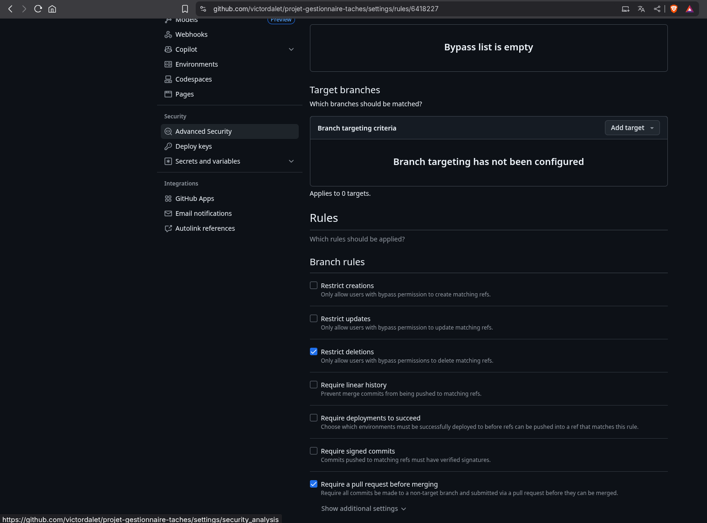

# projet-gestionnaire-taches

---

# I - Configuration du projet

---

### Gitignore

- On commence par créer un `.gitignore` à la racine du projet et l'on suprrimer les `node_modules` dans le dossier
  `backend` et `frontend`.
- On supprime également les fichiers de l'IDE
  

### Protection de la branche main

- On rajoute une règle de protection de la branche `main` dans les paramètres du repo GitHub.
- On active les options suivantes :
    - Require a pull request before merging
    - Require status checks to pass



### Invitation des membres

- On invite les membres du groupe dans le repo GitHub.
  

### Ajour doc

- On ajoute un fichier `how_launch.md` pour savoir comment lancer l'application (+ option lancement docker-compose).
  

# II - ESLINT

---

### Installation

- On configure eslint avec la commande suivante dans le repo (`backend` et `frontend`) :

```bash
npm init @eslint/config
```

- Pour tester on fait :

```bash
npx eslint .
```

- On fix les différents bug trouvé comme on peut voir dans cette image :
  

### GitHub Actions

- On ajoute dans les `package.json` des scripts pour lancer eslint dans le dossier `backend` et `frontend` :

```json
"scripts": {
"lint": "eslint ."
}
```

- On crée un fichier `.github/workflows/lint.yml`, dans lequel on ajoute le code suivant : `npm run lint`.

- Une fois le code push, on peut voir que le workflow s'exécute.
  

# BONUS : Deployment on docker hub

---

- Pour deployer l'application sur Docker Hub lorsque nous crérons une release, on crée un fichier `Dockerfile` dans le
  dossier `backend` et `frontend`.
  
- les différences des deux fichiers sont les ports utilisés par le backend et le frontend.
- On créer ensuite un fichier `docker-compose.yml` à la racine du projet
  
- On créer ensuite un fichier `.github/workflows/deploy.yaml` pour pouvoir lancer en cas de release le déploiement sur
  Docker Hub.
- On se rend dans les paramètres du repo GitHub, dans la section `Secrets and variables` :
  
- On ajoute les secrets suivants (que l'on peut obtenir en se créant un compte sur Docker Hub) :
    - `DOCKERHUB_TOKEN`
    - `DOCKERHUB_USERNAME`
      

- Pour tester notre code nous allons donc créer une release sur GitHub.
  
- Dans `action` il y a bien les actions qui se sont lancées.
  
- Si on va sur mon docker-hub, on peut voir que l'image a bien été créée. (https://hub.docker.com/search?q=victordalet)
  