# projet-gestionnaire-taches

---

# I - Configuration du projet

---

### Gitignore

- On commence par créer un `.gitignore` à la racine du projet et l'on suprrimer les `node_modules` dans le dossier
  `backend` et `frontend`.
- On supprime également les fichiers de l'IDE
  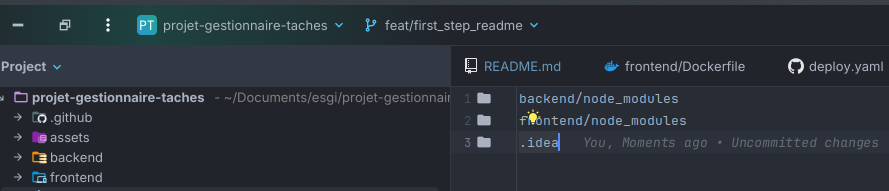

### Protection de la branche main

- On rajoute une règle de protection de la branche `main` dans les paramètres du repo GitHub.
- On active les options suivantes :
    - Require a pull request before merging
    - Require status checks to pass (on ajoute ici nos différents test comme dans le screen ci-dessous)

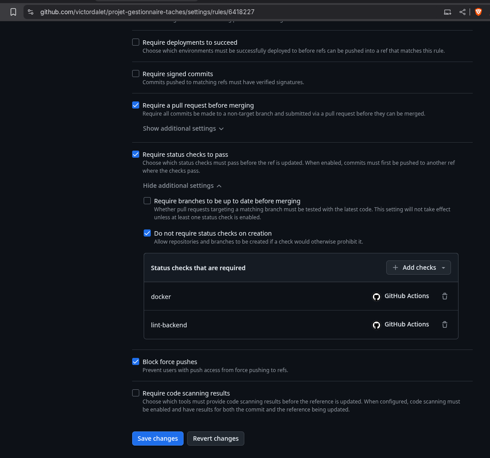

### Invitation des membres

- On invite les membres du groupe dans le repo GitHub.
  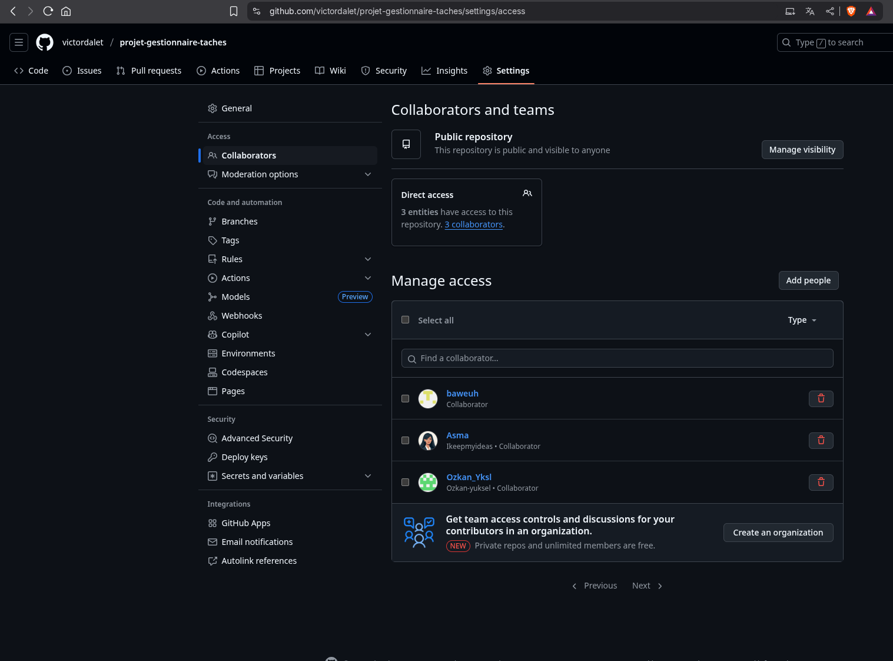

### Ajour doc

- On ajoute un fichier `how_launch.md` pour savoir comment lancer l'application (+ option lancement docker-compose).
  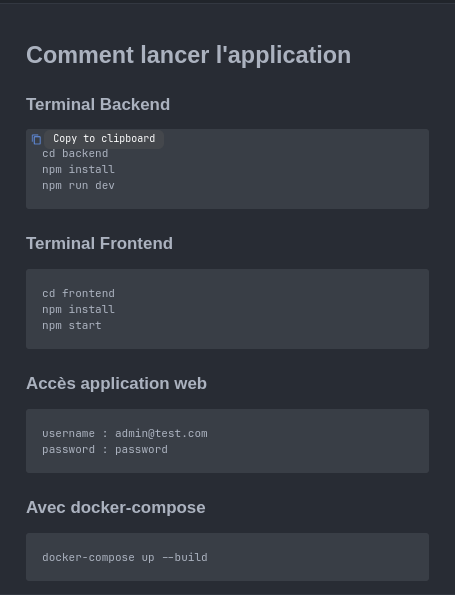


# Tests et qualité

# I - Tests E2E (Selenium)
Les tests E2E, ou “End to End”, permettent de vérifier que l’ensemble du parcours utilisateur fonctionne, du début à la fin. Donc tester toutes les étapes importantes comme la connexion, la création, la modification et la suppression d’une tâche, pour s’assurer que le système réagit bien.

Selenium est un outil qui automatise les interactions avec le navigateur web. Il simule un utilisateur réel en cliquant sur les boutons, remplissant les formulaires et naviguant sur le site.

On commence par prendre connaissance des interfaces backend et frontend.
Dans ce projet, il est nécessaire de créer un dossier tests qui contiendra l’ensemble des tests E2E réalisés avec Selenium.

Nous commençons par deux tests :
  - Connexion
  - Création d’une tâche

    
 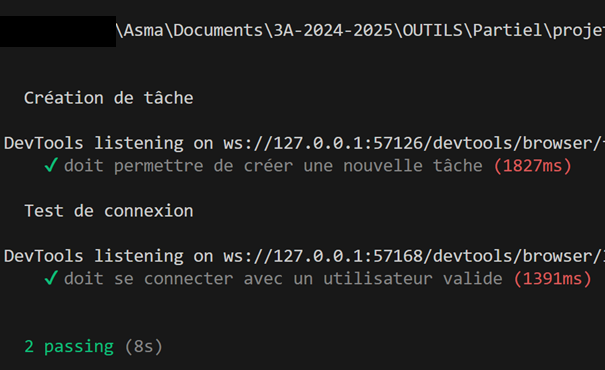

 
Ensuite, nous procédons à la vérification directement sur le site.

 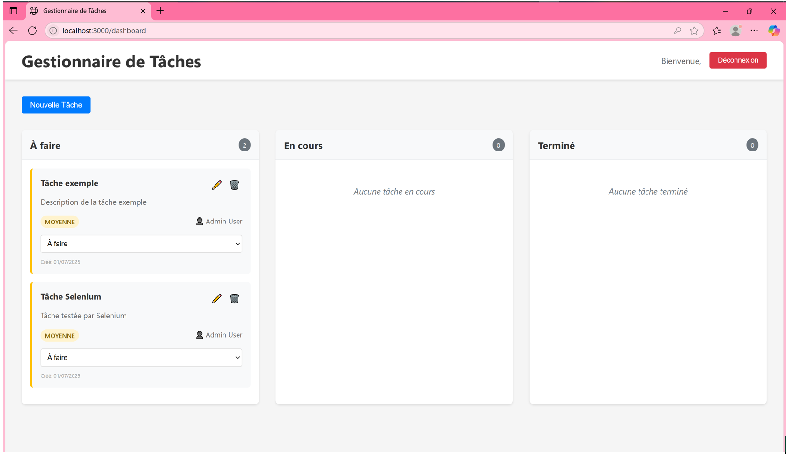
 
Passons maintenant à des tests CRUD simples, ce qui donne un total de 5 tests :

 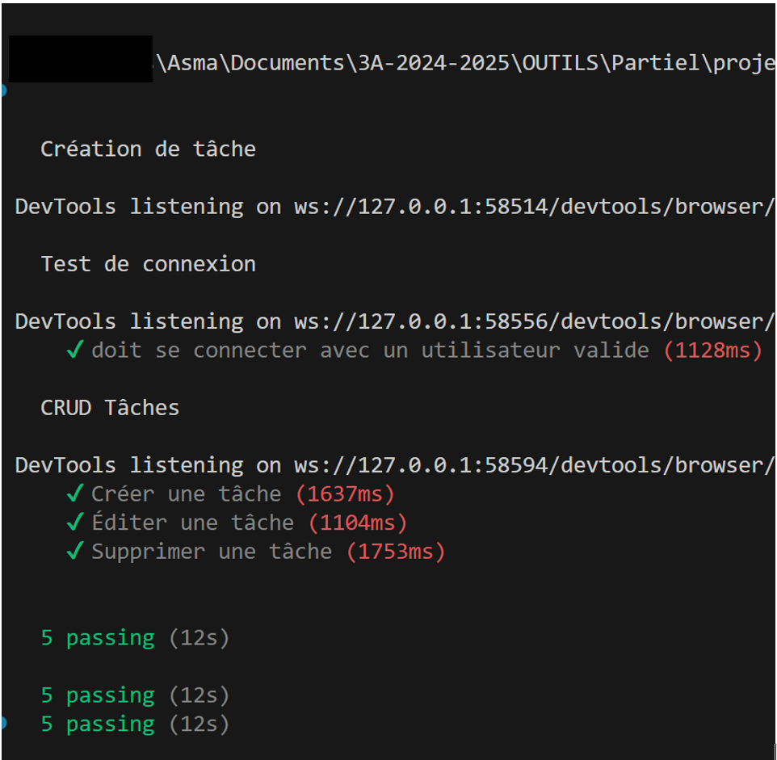
 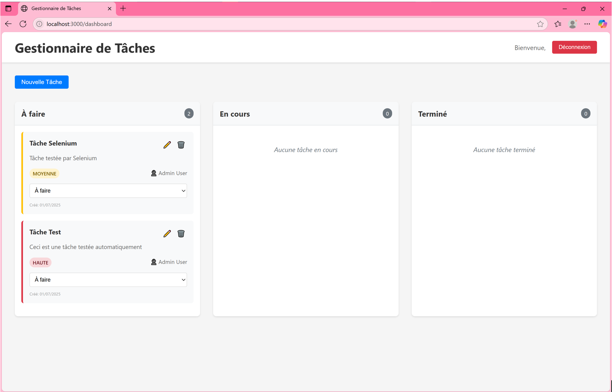

# II - ESLINT

---

### Installation

- On configure eslint avec la commande suivante dans le repo (`backend` et `frontend`) :

```bash
npm init @eslint/config
```

- Pour tester on fait :

```bash
npx eslint .
```

- On fix les différents bug trouvé comme on peut voir dans cette image :
  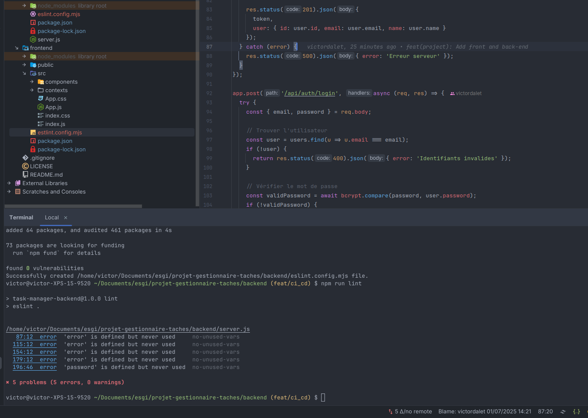

### GitHub Actions

- On ajoute dans les `package.json` des scripts pour lancer eslint dans le dossier `backend` et `frontend` :

```json
"scripts": {
"lint": "eslint ."
}
```

- On crée un fichier `.github/workflows/lint.yml`, dans lequel on ajoute le code suivant : `npm run lint`.

- Une fois le code push, on peut voir que le workflow s'exécute.
  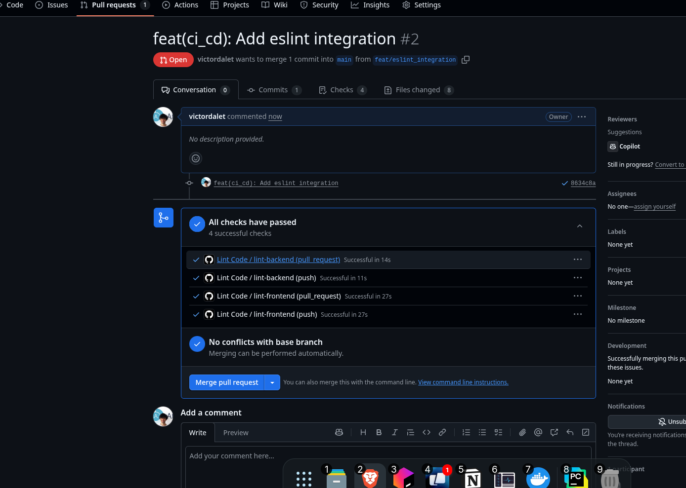

# III Tests Unitaires et Intégrations d'API endpoints

Pour les tests unitaires, **Jest** se révèle particulièrement adapté : il permet de vérifier isolément le comportement de chaque fonction, module ou middleware de votre application. Grâce à son exécution rapide et à sa syntaxe expressive (`describe`, `it`/`test`, `expect`), vous pouvez écrire des scénarios qui couvrent tous les cas d’usage de vos utilitaires, de votre logique métier et de vos validateurs. De plus, Jest intègre nativement la création de mocks et de spies, ce qui simplifie la simulation de dépendances externes et garde vos tests légers et déterministes.

Une fois cette couche unitaire solidement en place, il devient naturel de passer aux **tests d’intégration d’API endpoints**, où l’on vérifie l’enchaînement complet des requêtes HTTP et des réponses JSON en utilisant Jest couplé à Supertest.

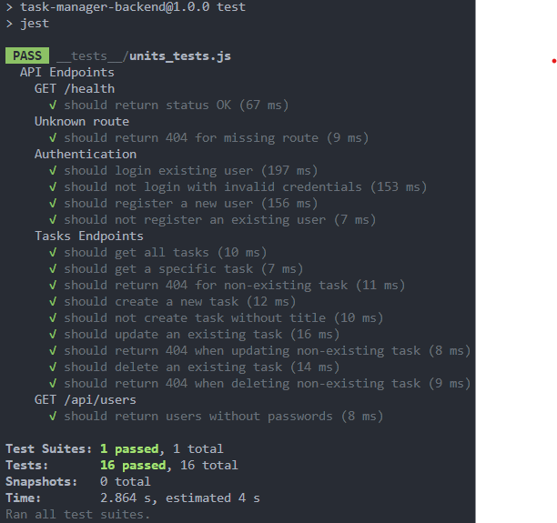

# BONUS : Deployment on docker hub

---

- Pour deployer l'application sur Docker Hub lorsque nous crérons une release, on crée un fichier `Dockerfile` dans le
  dossier `backend` et `frontend`.
  
- les différences des deux fichiers sont les ports utilisés par le backend et le frontend.
- On créer ensuite un fichier `docker-compose.yml` à la racine du projet
  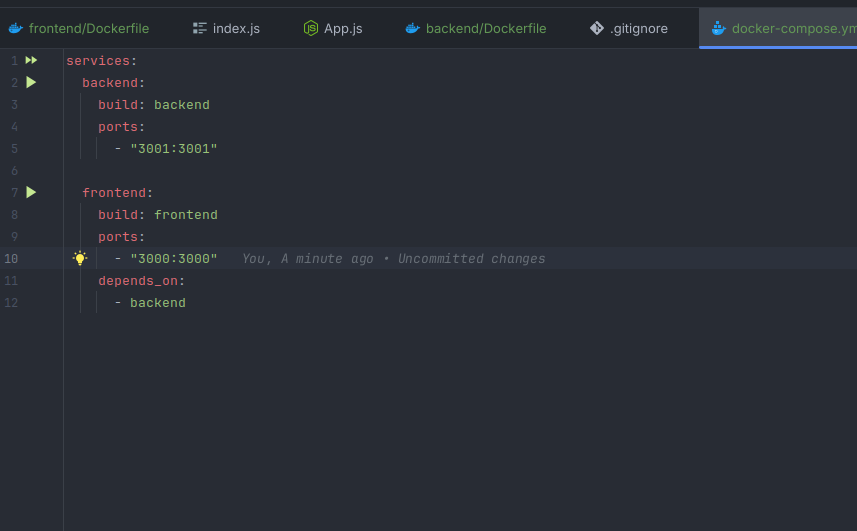
- On créer ensuite un fichier `.github/workflows/deploy.yaml` pour pouvoir lancer en cas de release le déploiement sur
  Docker Hub.
- On se rend dans les paramètres du repo GitHub, dans la section `Secrets and variables` :
  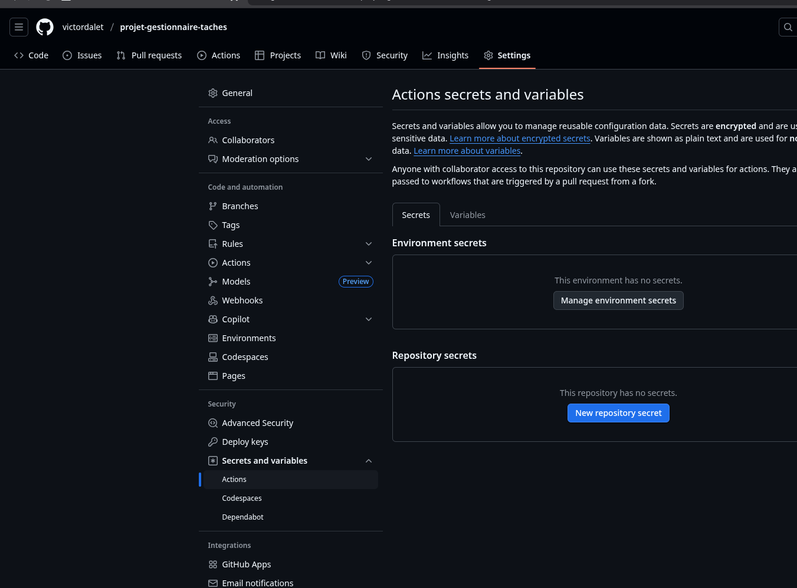
- On ajoute les secrets suivants (que l'on peut obtenir en se créant un compte sur Docker Hub) :
    - `DOCKERHUB_TOKEN`
    - `DOCKERHUB_USERNAME`
      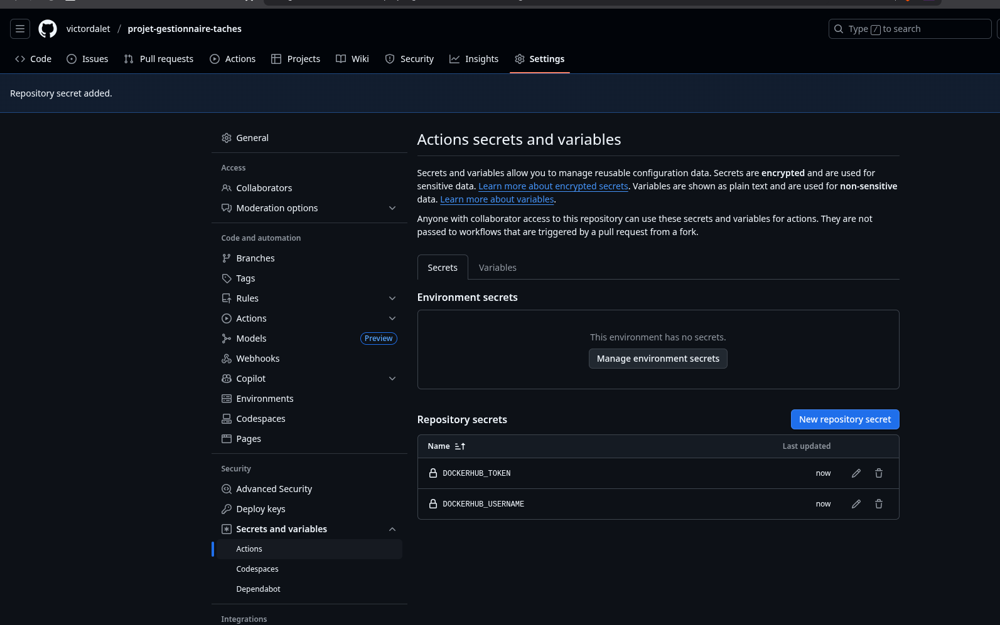

- Pour tester notre code nous allons donc créer une release sur GitHub.
  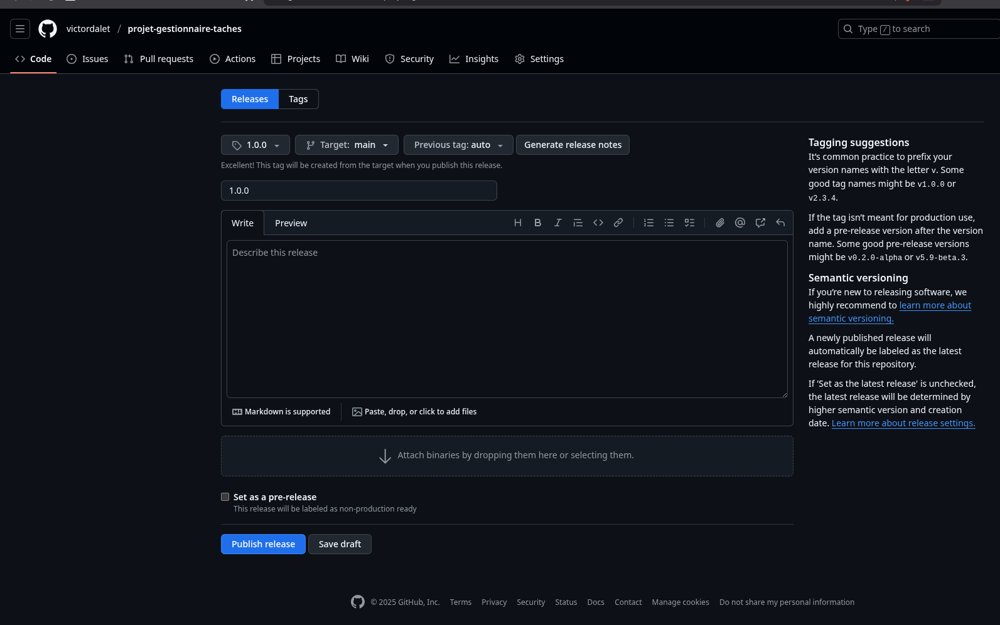
- Dans `action` il y a bien les actions qui se sont lancées.
  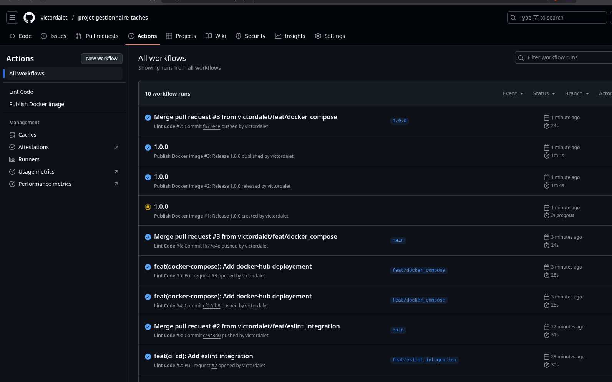
- Si on va sur mon docker-hub, on peut voir que l'image a bien été créée. (https://hub.docker.com/search?q=victordalet)
  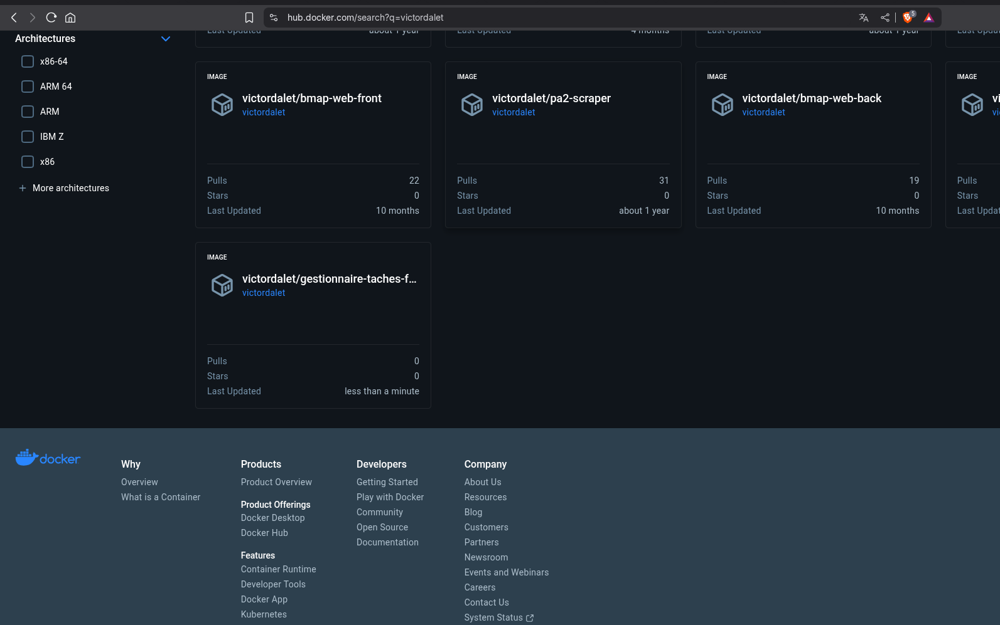
